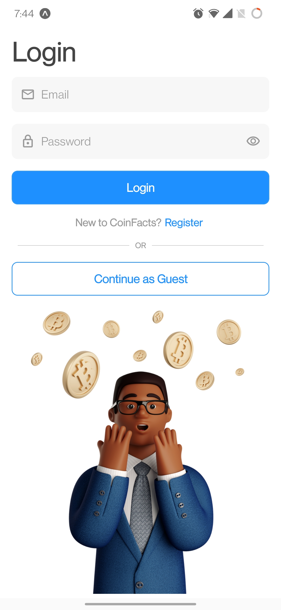
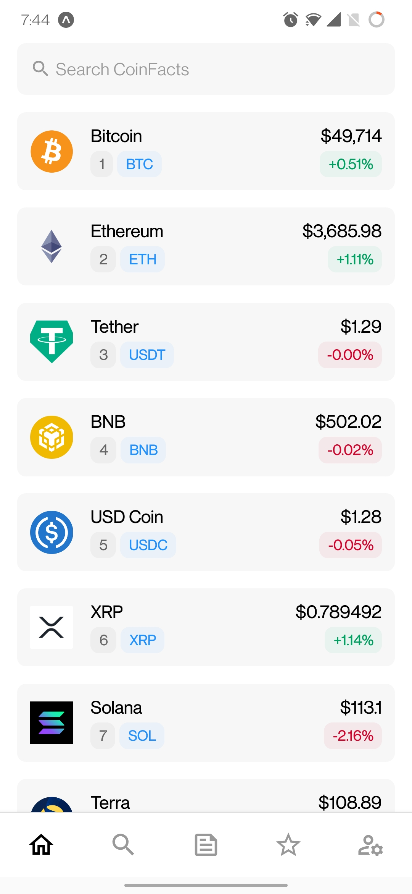
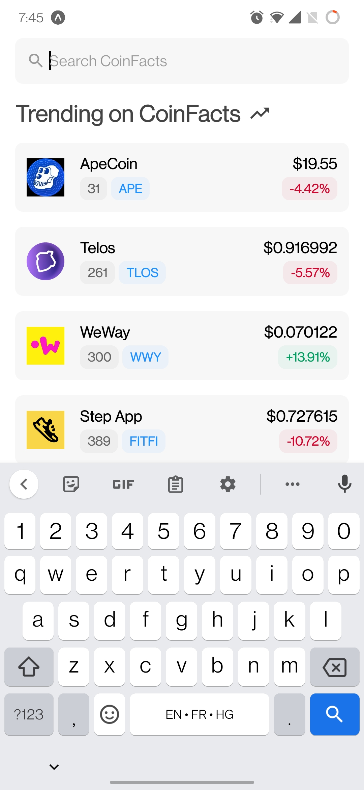
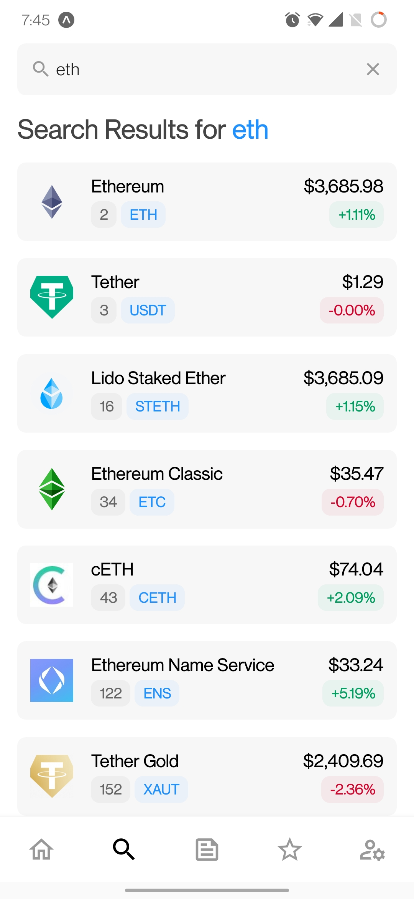
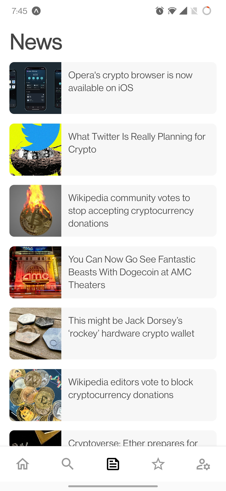
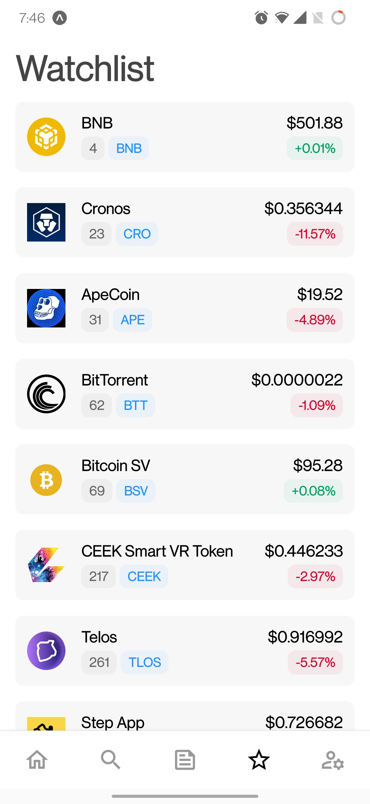
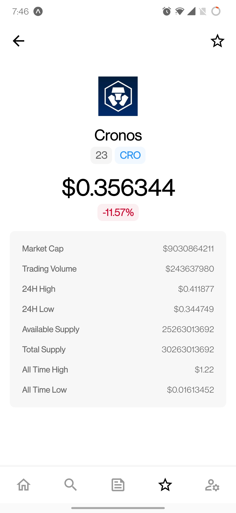

# CoinFacts
CoinFacts is a feature-rich cryptocurrency tracking app for Android and iOS developed using React Native.

## Screenshots

  
  
  
  
  
  
  
  

## Stack
* **[Expo](https://expo.dev/)**
* **[Typescript](https://www.typescriptlang.org/)**
* **[React Native](https://reactnative.dev/)**
* **[React Navigation](https://reactnavigation.org/)**
* **[Reanimated 2](https://docs.swmansion.com/react-native-reanimated/)**
* **[Firebase](https://firebase.google.com/)**
* **[React Native AsyncStorage](https://reactnative.dev/docs/asyncstorage)**
* **[React Native SVG](https://github.com/react-native-svg/react-native-svg)**

## APIs Used
* **[CoinGecko API](https://www.coingecko.com/en/api)** - To retrieve live cryptocurrency and market data, obtain search results, get coin details and fetch trending coins.
* **[News API](https://newsapi.org/)** - To retrieve latest news data (top 100 international news with keywords "crypto" and "cryptocurrency")

## Google Play Store and Apple App Store Link
**Coming soon!**
