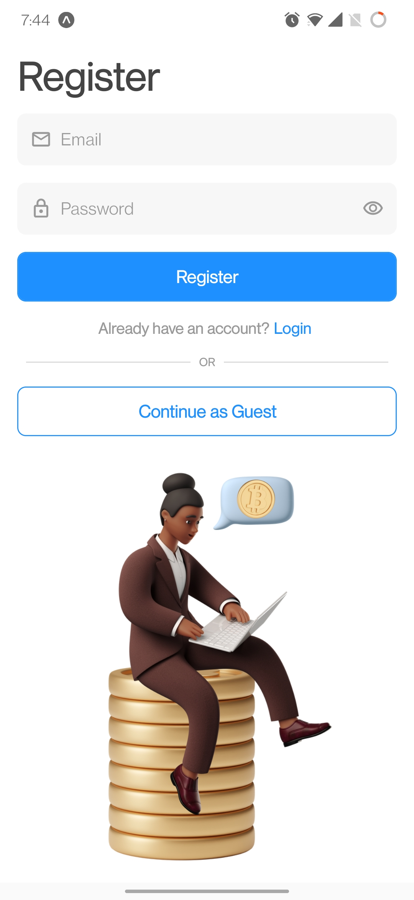

# CoinFacts
CoinFacts is a feature-rich cryptocurrency tracking app for Android and iOS developed using React Native.

## Screenshots

  
  
  
  
  
  
  
  

## How to run the app on your device
To run the app on your mobile device, follow these steps:-
* [Open this link](https://expo.dev/@arjunmehta/coinfacts-react-native)
* Download the Expo Go app from the Google Play Store/Apple App Store
* Scan the QR code in the link using the Camera app on your mobile device
* The link would redirect you to the Expo app and launch the application

## Stack
* **[Expo](https://expo.dev/)**
* **[Typescript](https://www.typescriptlang.org/)**
* **[React Native](https://reactnative.dev/)**
* **[React Navigation](https://reactnavigation.org/)**
* **[Reanimated 2](https://docs.swmansion.com/react-native-reanimated/)**
* **[Firebase](https://firebase.google.com/)**
* **[React Native AsyncStorage](https://reactnative.dev/docs/asyncstorage)**
* **[React Native SVG](https://github.com/react-native-svg/react-native-svg)**

## APIs Used
* **[CoinGecko API](https://www.coingecko.com/en/api)** - To retrieve live cryptocurrency and market data, obtain search results, get coin details and fetch trending coins.
* **[News API](https://newsapi.org/)** - To retrieve latest news data (top 100 international news with keywords "crypto" and "cryptocurrency").

## Architecture
* The project follows the recommended React Native architecture which is simple and easy-to-understand.
* Read more about the recommended project structure [here](https://reactnativeexample.com/react-native-project-structure/).

  

## Screens

### Login/Register Screen
* Allows the user to sign-up/sign-in.
* Signing-in enables the user to save coins to their portfolio/watchlist.
* Sign-up/sign-in is handled by Firebase backend through `Firebase Authentication`.
* The user can choose not to sign-up/sign-in by choosing the `Continue as Guest` option.

  
  
  

### Home Screen
* Displays the top 100 cyptocurrencies (coins) to the user (ranked by market cap).
* Clicking on a coin card navigates the app to the `CoinDetails` screen.
* A search bar is present on top at all times. Clicking it navigates to the `Search` screen.

  
  
  

### Search Screen
* On navigating to this screen, the user is shown the top 7 trending coins.
* The `SearchBar` can be used to search for a coin by its name.

  
  
  

### News Screen
* Presents the top 100 latest news related to `crypto` and `cryptocurrency` to the user.
* Clicking a `NewsCard` launches its link in the in-app browser (in a separate window).

  
  
  

### Watchlist Screen
* List all the coins that the user has added to their watchlist/portfolio in the past.
* The user `must be logged in` to access this feature.
* A watchlist icon is present on the Coin Details screen to quickly add/remove a coin from the watchlist.

  
  
  

### Error States
* When the searched query returns no results, an error message is shown to the user indicating this.
* When the user's watchlist is empty, a message is presented to inform the user of this case.
* An error screen is presented to the user when they try to add a coin to their watchlist when they are logged in as Guest.

  
  
  

## Google Play Store and Apple App Store Link
**Coming soon!**
